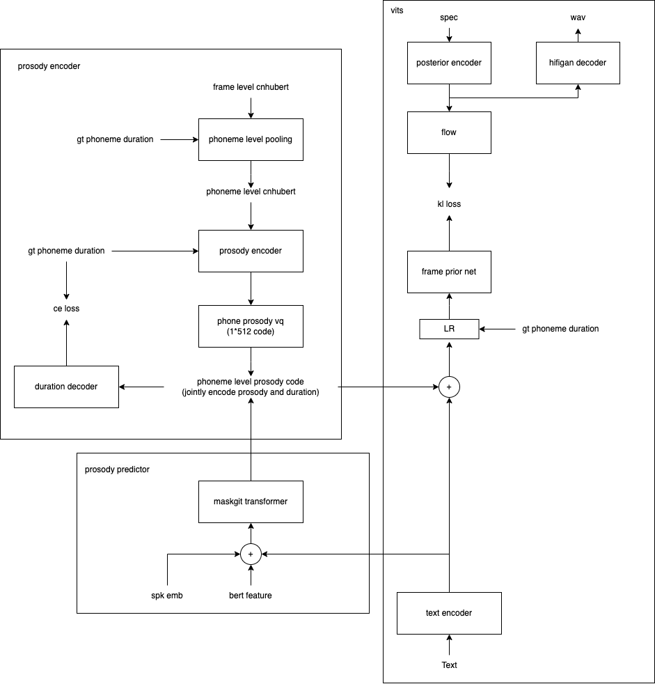

# MagVITS
VITS with phoneme-level prosody modeling based on MaskGIT （WIP）

feature: inference speed ~= bert-vits2 & prosody > bert-vits2 (maybe)

目前代码正在重构，可能还跑不通，目前不建议跑
中文预训练模型不久后会上传（数据：原神中文+aishell 共200h多一些）

### structure

### Acknowledgements
+ Thanks to the support of the GPUs by [leng-yue](https://github.com/leng-yue) [fishaudio](https://github.com/fishaudio)
+ [VITS](https://github.com/jaywalnut310/vits)
+ [MaskGIT](https://github.com/valeoai/Maskgit-pytorch/blob/main/Trainer/vit.py)
+ [AuxiliaryASR and styletts2](https://github.com/yl4579/AuxiliaryASR/)
+ [MegaTTS](https://arxiv.org/abs/2306.03509)
+ [descript-audio-codec](https://github.com/descriptinc/descript-audio-codec)
+ [visinger](https://github.com/zhangyongmao/VISinger2)
